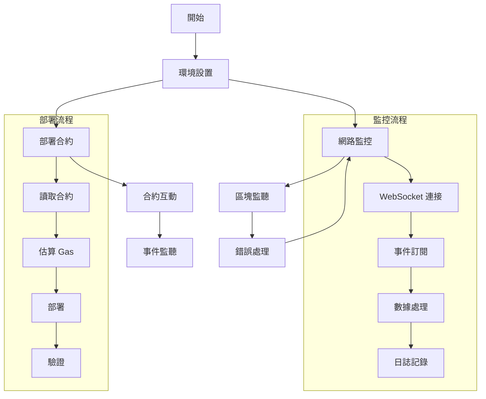

# Blockchain Scripts

## 目錄結構

```
scripts/
├── config/ # 配置文件
│ └── network.js # 網路設定
├── contracts/ # 合約相關腳本
│ ├── deploy.js # 部署腳本
│ └── interact.js # 互動腳本
├── utils/ # helper函數
│ ├── provider.js # Provider 設置
│ └── logger.js # 日誌工具
└── monitors/ # 監控腳本
└── websocket.js # WebSocket 監聽
```

## 使用方法

1. 設定環境變量
2. 運行腳本



## 使用方法

1. 環境設置

   - root 目錄下 `.env` 填入 QuickNode API URL 和 private-key

2. 安裝依賴

   ```bash
   npm install
   ```

3. 執行腳本

   ```bash
   # 安裝依賴
   npm install

   # 部署合約
   npm run deploy

   # 與合約互動
   npm run interact

   # 啟動監控
   npm run monitor
   ```

## 配置說明

1. 網路配置 (config/network.js)

   - 支援 Sepolia 測試網
   - 可擴展支援其他網路

2. 日誌系統 (utils/logger.js)
   - 錯誤日誌: logs/error.log
   - 綜合日誌: logs/combined.log
   - 開發環境下同時輸出到控制台

## 注意事項

1. 免費 API 限制

   - 請求頻率限制
   - 每日請求數限制
   - WebSocket 連接限制

2. 安全建議

   - 不要將私鑰提交到版本控制
   - 使用環境變數管理敏感資訊
   - 定期備份部署資訊

3. 最佳實踐
   - 部署前先在測試網測試
   - 監控 Gas 價格避免過高費用
   - 使用日誌追蹤問題

## 錯誤處理

1. 部署錯誤

   - 檢查網路連接
   - 確認賬戶餘額
   - 驗證合約代碼

2. 監控錯誤
   - WebSocket 自動重連
   - 錯誤日誌記錄
   - 郵件通知（可選）

## 貢獻指南

1. 提交 PR 前：

   - 確保代碼符合風格指南
   - 添加適當的測試
   - 更新文檔

2. 開發建議：
   - 使用 TypeScript 提高代碼質量
   - 添加單元測試
   - 保持向後兼容性

## 授權

MIT License
