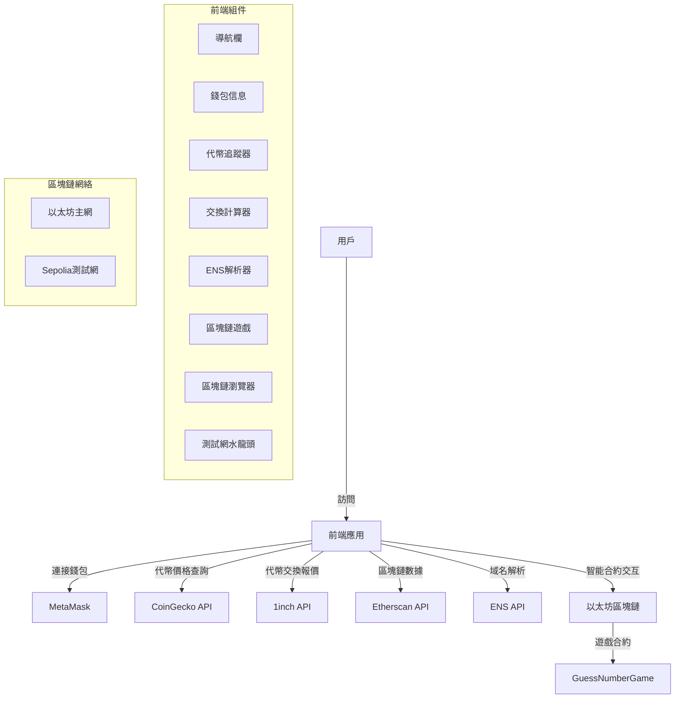
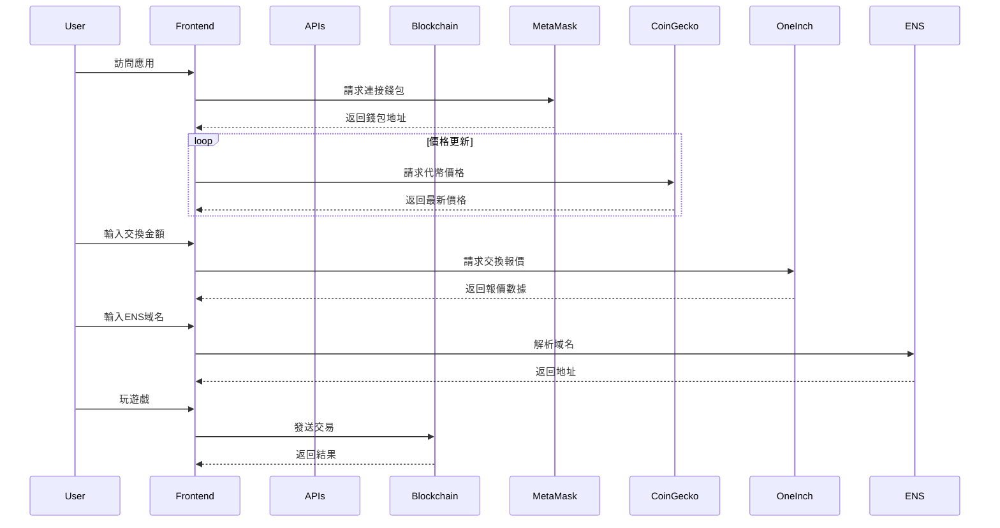
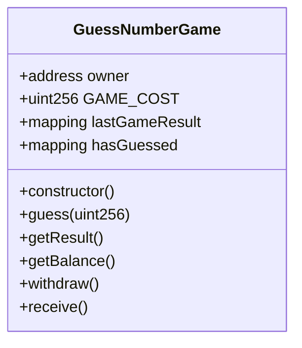
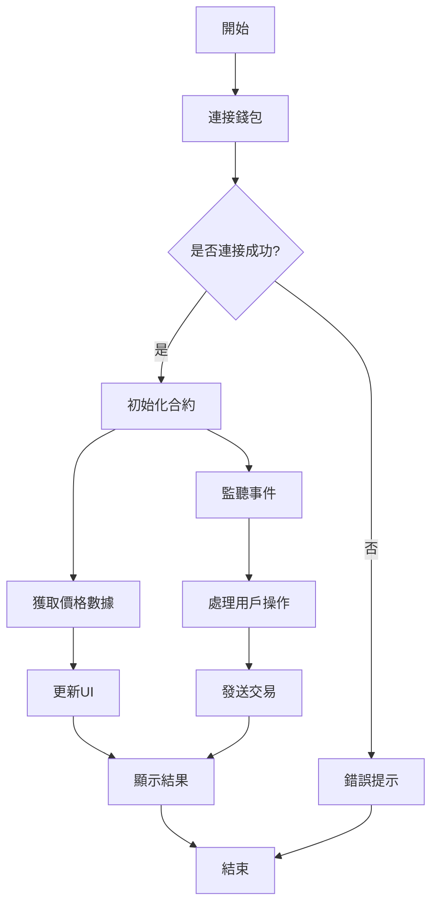

# ETH Gateway Demo

一個基於 React 和 Web3.js 的以太坊 DApp 示範專案，提供多種區塊鏈互動功能。

## 功能特點

- 錢包連接與管理
- 代幣價格追蹤
- 代幣交換計算器
- ENS 域名解析
- 區塊鏈遊戲
- 測試網水龍頭
- 區塊鏈瀏覽器

## tech stack

- React.js
- Web3.js
- Ethers.js
- i18next (多語言支持)
- Material-UI

## 安裝與運行

安裝依賴
npm install
運行開發服務器
npm start
構建生產版本
npm run build

## 環境要求

- Node.js >= 18
- MetaMask browser extension
- Sepolia testnet ETH (for testing, got to have some eth in it)

## API integrations

- 1inch API (代幣交換,要註冊跟 kyc)
- CoinGecko API (代幣價格)
- Etherscan API (區塊鏈數據)
- ENS API (域名解析)

## 項目結構

eth-project/
├── frontend/
│ ├── src/
│ │ ├── components/
│ │ ├── hooks/
│ │ ├── styles/
│ │ └── i18n/
│ ├── public/
│ └── package.json
└── contracts/
└── contract-related-files/

## 部署

使用 Vercel 進行自動部署。

## 貢獻指南

1. Fork 專案
2. 創建特性分支
3. 提交更改
4. 推送到分支
5. 創建 Pull Request

## 系統架構圖

## 組件數據流

## 合約功能圖

## 數據處理流程

## 授權

MIT License
